  

---

🪄 A personal collection of ready-to-use pieces for building better
GitHub READMEs — badges, icons, images, stats widgets, section templates, and more.  

## About

This repository is a library, not a project. There's no app to run and nothing to install — it's a place to store and organize snippets that get reused across other repositories' README files, so they don't have to be recreated (or re-googled) every time.  

## What's inside

- **Badges** — badges for status, build, tech stack, and license, in various styles
- **Icons** — small icon/logo snippets for tech stacks and skills
- **Images** — banners, dividers, and other visual assets
- **Stats** — GitHub stats cards, streak stats, and activity widgets
- **Templates**   

## Credits / Sources**  

Some components here are generated by or adapted from third-party tools and projects. Main sources:
> - **Badges** — [Shields.io](https://shields.io)
> - **Icons** — [Simple Icons](https://simpleicons.org) (CC0), [Devicon](https://devicon.dev) (MIT)
> - **Stats** — [github-readme-stats](https://github.com/anuraghazra/github-readme-stats) by [@anuraghazra](https://github.com/anuraghazra)

