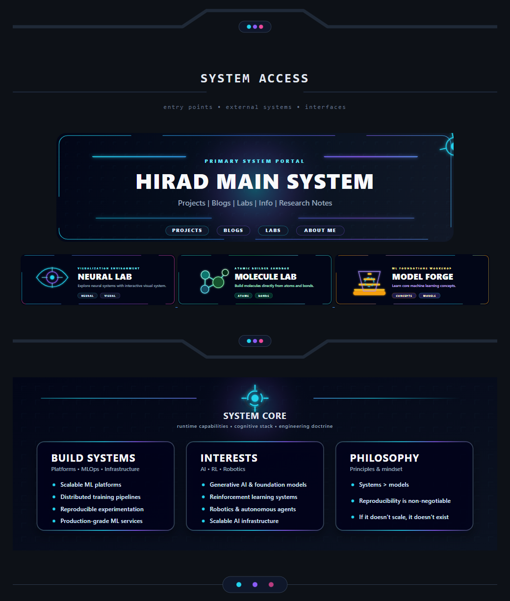
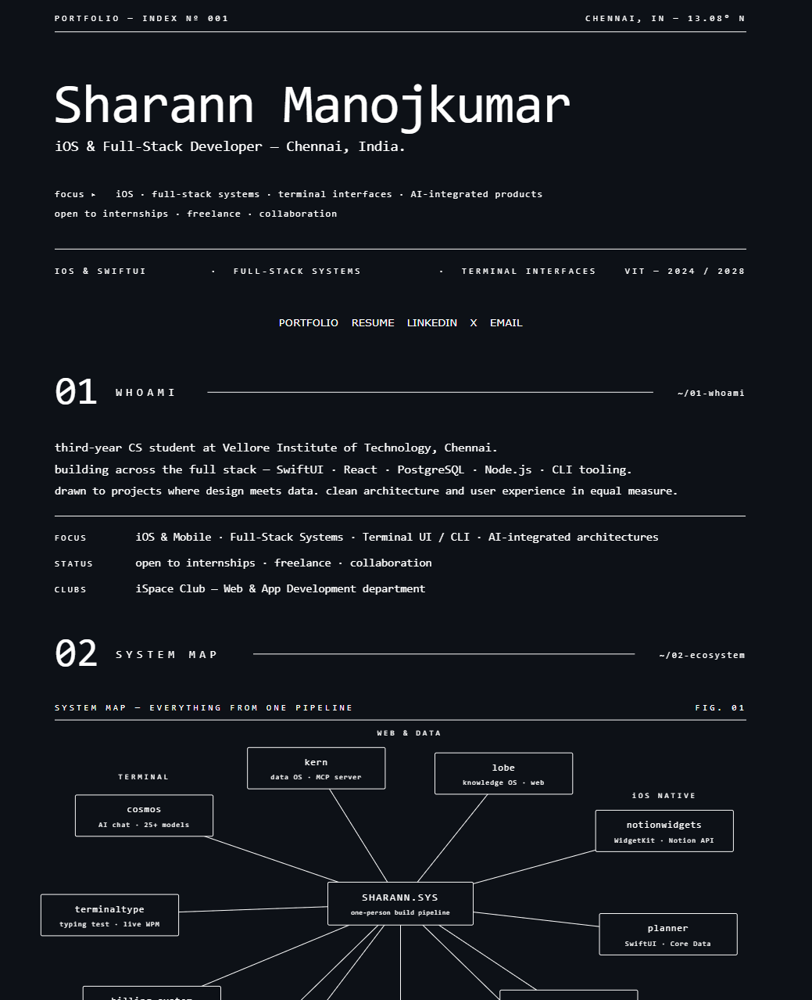

# Profile Inspiration

A curated collection of developer profile and portfolio designs for README and personal-site inspiration.

## 1. Hirad Main System

**Source:** [HiradEmami on GitHub](https://github.com/HiradEmami)

---

## 2. Sharann Manojkumar

**Source:** [Sharann's portfolio](https://sharann.dev/)

